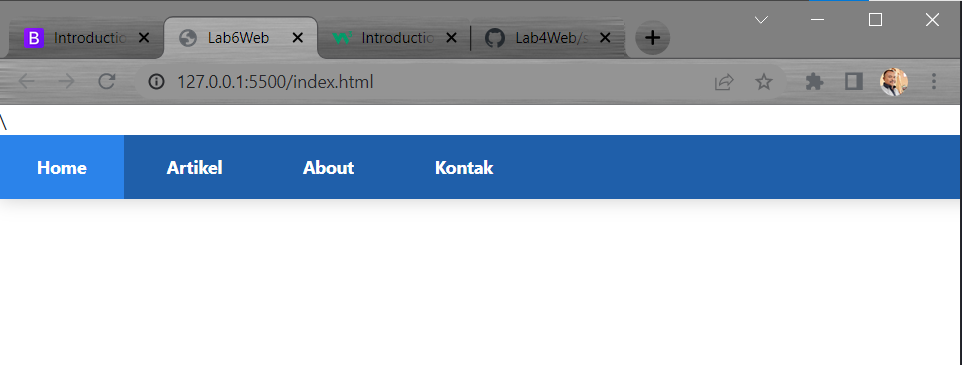

# LayOut Sederhana Menggunakan Bootstrap Framewok

## Langkah-Langkah pembuatan layout sederhana menggunakan bootstrap framework

### 1. **Membuat Documen html**

```html
<!DOCTYPE html>
<html lang="en">
  <head>
    <meta charset="UTF-8" />
    <meta http-equiv="X-UA-Compatible" content="IE=edge" />
    <meta name="viewport" content="width=device-width, initial-scale=1.0" />
    <title>Bootstrap Framework</title>
  </head>
  <body></body>
</html>
```

### 2. Getstart

**[Bootstrap framework](https://getbootstrap.com/)**, boostrap sendiri merupakan website open source yang didalam nya terdapat file css,js tapi saya memilih menggunakan link

```html
<head>
    <!-- GETSTART Bootstrap css framework -->
    <link href="https://cdn.jsdelivr.net/npm/bootstrap@5.1.3/dist/css/bootstrap.min.css" rel="stylesheet"
        integrity="sha384-1BmE4kWBq78iYhFldvKuhfTAU6auU8tT94WrHftjDbrCEXSU1oBoqyl2QvZ6jIW3" crossorigin="anonymous">
    <!-- End Bootstrap css framework -->
</head>
<!-- LAYOUT SEDERHANA BOOTSTRAP FRAMEWORK -->
<body>


    <!-- GETSTART Bootstrap js framework -->
    <script src="https://cdn.jsdelivr.net/npm/bootstrap@5.1.3/dist/js/bootstrap.bundle.min.js"
        integrity="sha384-ka7Sk0Gln4gmtz2MlQnikT1wXgYsOg+OMhuP+IlRH9sENBO0LRn5q+8nbTov4+1p"
        crossorigin="anonymous"></script>
    <script src="https://cdn.jsdelivr.net/npm/@popperjs/core@2.10.2/dist/umd/popper.min.js"
        integrity="sha384-7+zCNj/IqJ95wo16oMtfsKbZ9ccEh31eOz1HGyDuCQ6wgnyJNSYdrPa03rtR1zdB"
        crossorigin="anonymous"></script>
    <script src="https://cdn.jsdelivr.net/npm/bootstrap@5.1.3/dist/js/bootstrap.min.js"
        integrity="sha384-QJHtvGhmr9XOIpI6YVutG+2QOK9T+ZnN4kzFN1RtK3zEFEIsxhlmWl5/YESvpZ13"
        crossorigin="anonymous"></script>
        <!-- End Bootstrap js framework -->
</body>

</html>
```

### 3. NavBar

```html
<!--Navbar-->
<nav>
  <a href="index.html" class="active">Home</a>
  <a href="#">Artikel</a>
  <a href="#">About</a>
  <a href="#">Kontak</a>
</nav>
<!--End nav bar-->
```
