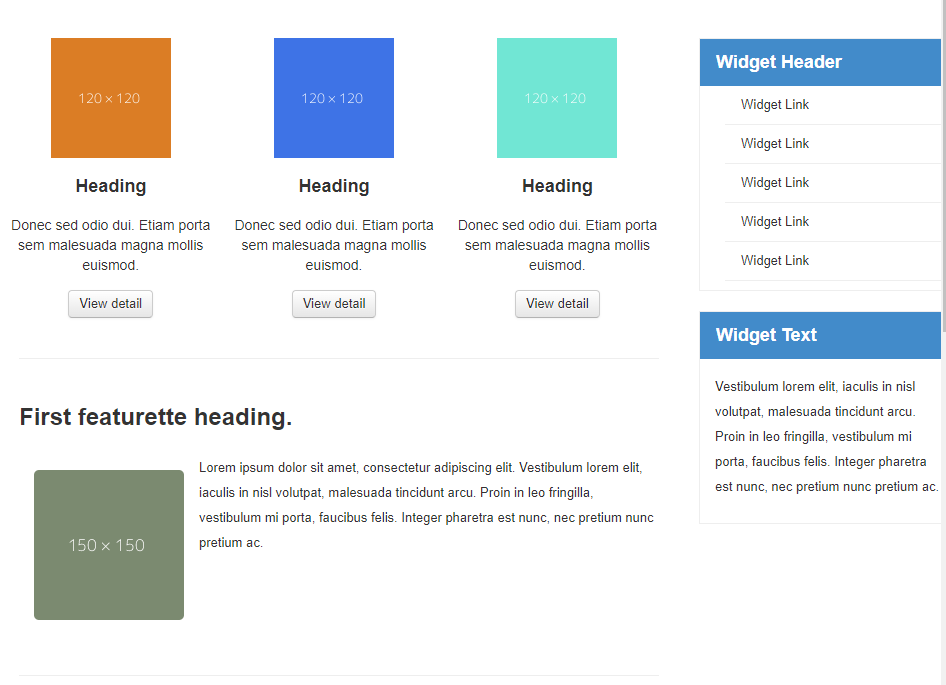

# LayOut Sederhana Menggunakan Bootstrap Framewok

## Langkah-Langkah pembuatan layout sederhana menggunakan bootstrap framework

### 1. **Membuat Documen html**

```html
<!DOCTYPE html>
<html lang="en">
  <head>
    <meta charset="UTF-8" />
    <meta http-equiv="X-UA-Compatible" content="IE=edge" />
    <meta name="viewport" content="width=device-width, initial-scale=1.0" />
    <title>Bootstrap Framework</title>
  </head>
  <body></body>
</html>
```

### 2. Getstart

**[Bootstrap framework](https://getbootstrap.com/)**, boostrap sendiri merupakan website open source yang didalam nya terdapat file css,js berikut file yang saya gunakan.

```html
<head>
    <!-- GETSTART Bootstrap css framework -->
   <link rel="stylesheet" href="asset/bootstrap/css/bootstrap-responsive.css">
    <link rel="stylesheet" href="asset/bootstrap/css/bootstrap-responsive.min.css">
    <link rel="stylesheet" href="asset/bootstrap/css/bootstrap.css">
    <link rel="stylesheet" href="asset/bootstrap/css/bootstrap.min.css">
    <!-- End Bootstrap css framework -->
</head>
<!-- LAYOUT SEDERHANA BOOTSTRAP FRAMEWORK -->
<body>

    <!-- GETSTART Bootstrap js framework -->
    <script src="asset/bootstrap/js/bootstrap.js"></script>
    <script src="asset/bootstrap/js/bootstrap.min.js"></script>
        <!-- End Bootstrap js framework -->
</body>

</html>
```

### 3. NavBar

```html
<!--Navbar-->
<nav>
  <a href="index.html" class="active">Home</a>
  <a href="#">Artikel</a>
  <a href="#">About</a>
  <a href="#">Kontak</a>
</nav>
<!--End nav bar-->
```


### 4. Hero selection

```html
<!--Hero selection-->
<section id="hero">
  <h1>HELLO WORLD</h1>
  <p>
    Lorem ipsum dolor sit amet, consectetur adipiscing elit. Vestibulum lorem
    elit, iaculis innisl volutpat, malesuada tincidunt arcu. Proin in leo
    fringilla, vestibulum mi porta, faucibus felis. Integer pharetra est nunc,
    nec pretium nunc pretium ac.
  </p>
  <a href="index.html" class="btn btn-large">Learn more &raquo;</a>
</section>
<!--End hero selection-->
```


### 5. Cards

Untuk membuat body konten, saya menggunakan cards.

```html
<section id="wrapper">
  <section id="main">
    <div class="row">
      <div class="box">
        
        <h3>Heading</h3>
        <p>
          Donec sed odio dui. Etiam porta sem malesuada magna mollis euismod.
        </p>
        <a href="#" class="btn btn-default">View detail</a>
      </div>
      <div class="box">
        
        <h3>Heading</h3>
        <p>
          Donec sed odio dui. Etiam porta sem malesuada magna mollis euismod.
        </p>
        <a href="#" class="btn btn-default">View detail</a>
      </div>
      <div class="box">
        
        <h3>Heading</h3>
        <p>
          Donec sed odio dui. Etiam porta sem malesuada magna mollis euismod.
        </p>
        <a href="#" class="btn btn-default">View detail</a>
      </div>
    </div>
  </section>
</section>
```


### 6. List Group

```html
<aside id="sidebar">
  <div class="widget-box">
    <h3 class="title">Widget Header</h3>
    <ul>
      <li><a href="#">Widget Link</a></li>
      <li><a href="#">Widget Link</a></li>
      <li><a href="#">Widget Link</a></li>
      <li><a href="#">Widget Link</a></li>
      <li><a href="#">Widget Link</a></li>
    </ul>
  </div>
  <div class="widget-box">
    <h3 class="title">Widget Text</h3>
    <p>
      Vestibulum lorem elit, iaculis in nisl volutpat, malesuada tincidunt arcu.
      Proin in leo fringilla, vestibulum mi porta, faucibus felis. Integer
      pharetra est nunc, nec pretium nunc pretium ac.
    </p>
  </div>
</aside>
```


### 7. Article

```html
<div>
  <hr class="divider" />
  <article class="entry">
    <h2>First featurette heading.</h2>
    
    <p>
      Lorem ipsum dolor sit amet, consectetur adipiscing elit. Vestibulum lorem
      elit, iaculis in nisl volutpat, malesuada tincidunt arcu. Proin in leo
      fringilla, vestibulum mi porta, faucibus felis. Integer pharetra est nunc,
      nec pretium nunc pretium ac.
    </p>
  </article>
  <hr class="divider" />
  <article class="entry">
    <h2>First featurette heading.</h2>
    
    <p>
      Lorem ipsum dolor sit amet, consectetur adipiscing elit. Vestibulum lorem
      elit, iaculis in nisl volutpat, malesuada tincidunt arcu. Proin in leo
      fringilla, vestibulum mi porta, faucibus felis. Integer pharetra est nunc,
      nec pretium nunc pretium ac.
    </p>
  </article>
  <hr class="divider" />
</div>
```


### 8. Footer 
